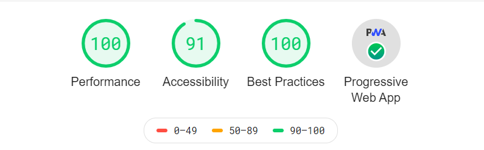

# nehaniphadkar.in [](https://app.netlify.com/sites/nehaniphadkar/deploys) [](https://opensource.org/licenses/MIT)

Personal website running on Gatsby, React, and Node.js.

## [Setting Up Your Development Environment](https://www.gatsbyjs.org/tutorial/part-zero/)

```bash
git clone https://github.com/niphadkarneha/gatsby-blog-neha.git
cd gatsby-blog-neha
gatsby develop
```

Navigate to `localhost:8000`.


## Acknowledgements

- Kyle Mathews - [One who introduced GatsbyJS to the world.](https://www.bricolage.io/blog/)
- Tania Rascia - [Full stack developer and an inspiration](https://www.taniarascia.com/)
- Leko Arts - [gatsby-starter-prismic](https://github.com/LekoArts/gatsby-starter-prismic)
- Muhammad Muhsin - [Using React Context API with Gatsby](https://www.gatsbyjs.org/blog/2019-01-31-using-react-context-api-with-gatsby/)
- Thomas Frössman - [ExitWP](https://github.com/thomasf/exitwp) - WordPress XML to Markdown

## License

This project is open source and available under the [MIT License](LICENSE).

[Lighthouse Report](https://lighthousereport.netlify.com)

