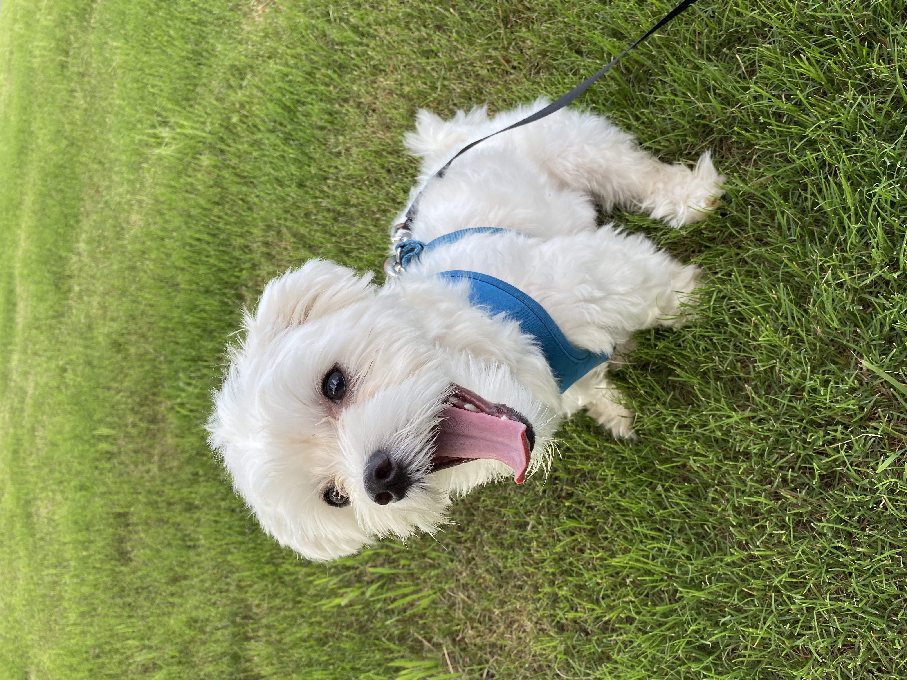

# Hello, World 😀

I'm a Data Analytics Manager at [Old Dominion University](https://www.odu.edu/directory/people/n/nniph001) working for Digital Transformation and Technology in Norfolk, Virginia. I stumble into coding ever so often. I studied Computer Science at [Tidewater Community College](https://www.tcc.edu) and [Old Dominion University](https://www.odu.edu/compsci).

I love traveling, reading, taking photos, and musicals (Bollywood Buff). I'm learning how to play a guitar 🎸 and a keyboard 🎹 . My resume is available if you want to be all formal and the usual stuff ⬇

- [LinkedIn](https://www.linkedin.com/in/niphad/)

Also, I'd like you to meet Leo, little 10 pound monster who keeps me on my toes 
