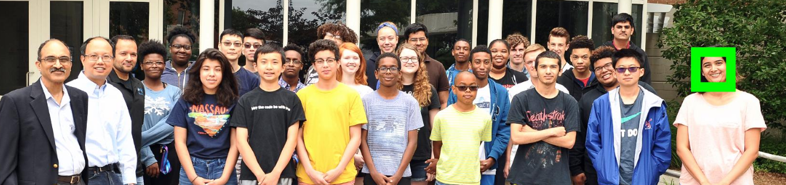
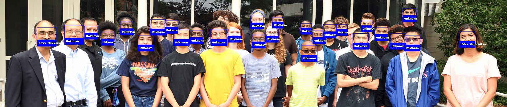

#Work-In-Progress

CS50 or Computer Science 50 is a series of introductory course taught at Harvard University. Amongst the lecture series,  [CS50 2019 - Lecture 6 - Python](https://www.youtube.com/watch?v=fL308_-Kbt0) taught by Dr. David Malan is one of the best introductory courses out there. I learned python on my own through scraping the web but CS50 python course is absolute joy to watch. I would highly recommend it to anyone who is trying or thinking of learning python. Towards the end of Lecture 6, Dr. Malan plays with Facial Recognition and I could not help but think when I started out it was not this easy.

Dr. Malan made use of a library in Python called, [Face Recognition](https://pypi.org/project/face_recognition/), which is by far the simplest library out there equipped with a lot
of sample source codes. I tried it for myself but I did not the reader of this article to worry about installing libraries of making sure that they had the right version of Python installed.
So, I decided to run the code on Google Colaboratory, all you need to make sure is that you have a google account to sign in.

Face Recognition library let's you upload a known image which will be used for the purpose of identification. I have used an image that can be found on almost all of my social media accounts

Python is going to rely on libraries like Face Recognition, Pillow, and NumPy to use the known image and search for my face in the group. As a test image, I have used a group image. This particular photograph was taken last year in Summer 2018, when I volunteered for the Machine Learning and Data Science Bootcamp held at Old Dominion University (ODU) in collaboration with Virginia Space Grant Consortium (VSGC). In this image, you will see Me(Neha), Dr. Ravi Mukkamala (Chair - Department of Computer Science), Dr. Yaohang Li (Associate Professor at ODU), and seniors from High School in the Hampton Roads area. This workshop was conducted in order to promote STEM education. You can see we can successfully detect my face, and it can be marked by a bounding box around it.

Let's try and recognize more people in the same group picture. Let's try and recognize the Chair for the Department of Computer Science at ODU, Dr. Ravi Mukkamala, and we'll for everyone else in the image, we will try and tag them as unknown. In order to do this, we will need to download Image and ImageDraw from the Pillow library since I will be drawing on the images. Just like our previous example, the way we identified my image, we will replicate it for Dr. Ravi. I will load_image_file as a numpy array, then I will use face_encodings to return a list of 128-dimensional face encodings.
We will only need the first item and we can set the index to [0]. Now, we have face encodings for me and Dr. Ravi.

The next thing I want to do is create a list of encoding and names for both of us. The rest of the procedure remains fairly identical to the first process. In the resulting image below, you can see that all of the faces are annotated with some information, in case of Dr. Ravi and myself we have our names below our images but rest of them are labelled as unknown.

This blog was an introductory to Face Recognition with Python, you can try this for yourself, just download the [ImageRecognition.ipnyb](https://github.com/niphadkarneha/FaceRecognition/blob/master/ImageRecognition.ipynb) you can either run it on Anaconda or Google Colab, the choice is yours.

<embed src="https://gist.github.com/niphadkarneha/a62b835f0f17dd27c34dcf345dda227f.js" style="width:900px; height: 700px;">

If you want to watch the CS50 Lecture 6 Python, you can watch the whole thing there

<iframe width="560" height="315" src="https://www.youtube.com/embed/fL308_-Kbt0" frameborder="0" allow="accelerometer; autoplay; encrypted-media; gyroscope; picture-in-picture" allowfullscreen></iframe>

Happy Learning 📜
