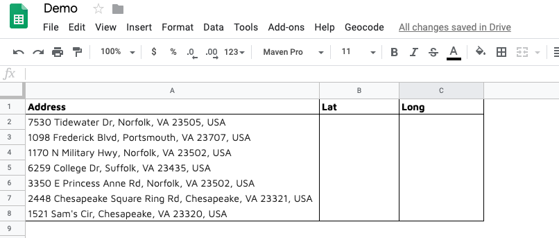

## Extracting latitude and longitude with google scripts.

The 3 step guide to extracting latitude and longitude from addresses and extracting address from latitude and longitude. In this short tutorial, we are going to use

1. Google sheets
2. Google scripts


### Step 1.
To get started open a Google Spreadsheet or Sheets. Start a new spreadsheet by clicking the ‘+’ icon. Let’s name it, ‘Demo’.



### Step 2.
Click on Tools and <>Script editor.
Copy-paste this code and save the script. You might have to close and reopen your, “Demo” sheet if you are unable to see the Geocode option in the navigation bar.

```googlescript
function getGeocodingRegion() {
  return PropertiesService.getDocumentProperties().getProperty('GEOCODING_REGION') || 'us';
}
/*
function setGeocodingRegion(region) {
  PropertiesService.getDocumentProperties().setProperty('GEOCODING_REGION', region);
  updateMenu();
}
function promptForGeocodingRegion() {
  var ui = SpreadsheetApp.getUi();
  var result = ui.prompt(
    'Set the Geocoding Country Code (currently: ' + getGeocodingRegion() + ')',
    'Enter the 2-letter country code (ccTLD) that you would like ' +
    'the Google geocoder to search first for results. ' +
    'For example: Use \'uk\' for the United Kingdom, \'us\' for the United States, etc. ' +
    'For more country codes, see: https://en.wikipedia.org/wiki/Country_code_top-level_domain',
    ui.ButtonSet.OK_CANCEL
  );
  // Process the user's response.
  if (result.getSelectedButton() == ui.Button.OK) {
    setGeocodingRegion(result.getResponseText());
  }
}
*/
function addressToPosition() {
  var sheet = SpreadsheetApp.getActiveSheet();
  var cells = sheet.getActiveRange();
  
  // Must have selected 3 columns (Address, Lat, Lng).
  // Must have selected at least 1 row.
if (cells.getNumColumns() != 3) {
    Logger.log("Must select at least 3 columns: Address, Lat, Lng columns.");
    return;
  }
  
  var addressColumn = 1;
  var addressRow;
  
  var latColumn = addressColumn + 1;
  var lngColumn = addressColumn + 2;
  
  var geocoder = Maps.newGeocoder().setRegion(getGeocodingRegion());
  var location;
  
  for (addressRow = 1; addressRow <= cells.getNumRows(); ++addressRow) {
    var address = cells.getCell(addressRow, addressColumn).getValue();
    
    // Geocode the address and plug the lat, lng pair into the 
    // 2nd and 3rd elements of the current range row.
    location = geocoder.geocode(address);
   
    // Only change cells if geocoder seems to have gotten a 
    // valid response.
    if (location.status == 'OK') {
      lat = location["results"][0]["geometry"]["location"]["lat"];
      lng = location["results"][0]["geometry"]["location"]["lng"];
      
      cells.getCell(addressRow, latColumn).setValue(lat);
      cells.getCell(addressRow, lngColumn).setValue(lng);
    }
  }
};
function positionToAddress() {
  var sheet = SpreadsheetApp.getActiveSheet();
  var cells = sheet.getActiveRange();
  
  // Must have selected 3 columns (Address, Lat, Lng).
  // Must have selected at least 1 row.
if (cells.getNumColumns() != 3) {
    Logger.log("Must select at least 3 columns: Address, Lat, Lng columns.");
    return;
  }
var addressColumn = 1;
  var addressRow;
  
  var latColumn = addressColumn + 1;
  var lngColumn = addressColumn + 2;
  
  var geocoder = Maps.newGeocoder().setRegion(getGeocodingRegion());
  var location;
  
  for (addressRow = 1; addressRow <= cells.getNumRows(); ++addressRow) {
    var lat = cells.getCell(addressRow, latColumn).getValue();
    var lng = cells.getCell(addressRow, lngColumn).getValue();
    
    // Geocode the lat, lng pair to an address.
    location = geocoder.reverseGeocode(lat, lng);
   
    // Only change cells if geocoder seems to have gotten a 
    // valid response.
    Logger.log(location.status);
    if (location.status == 'OK') {
      var address = location["results"][0]["formatted_address"];
cells.getCell(addressRow, addressColumn).setValue(address);
    }
  }  
};
function generateMenu() {
  // var setGeocodingRegionMenuItem = 'Set Geocoding Region (Currently: ' + getGeocodingRegion() + ')';
  
  // {
  //   name: setGeocodingRegionMenuItem,
  //   functionName: "promptForGeocodingRegion"
  // },
  
  var entries = [{
    name: "Geocode Selected Cells (Address to   Lat, Long)",
    functionName: "addressToPosition"
  },
  {
    name: "Geocode Selected Cells (Address from Lat, Long)",
    functionName: "positionToAddress"
  }];
  
  return entries;
}
function updateMenu() {
  SpreadsheetApp.getActiveSpreadsheet().updateMenu('Geocode', generateMenu())
}
/**
 * Adds a custom menu to the active spreadsheet, containing a single menu item
 * for invoking the readRows() function specified above.
 * The onOpen() function, when defined, is automatically invoked whenever the
 * spreadsheet is opened.
 *
 * For more information on using the Spreadsheet API, see
 * https://developers.google.com/apps-script/service_spreadsheet
 */
function onOpen() {
  SpreadsheetApp.getActiveSpreadsheet().addMenu('Geocode', generateMenu());
  // SpreadsheetApp.getActiveSpreadsheet().addMenu('Region',  generateRegionMenu());
  // SpreadsheetApp.getUi()
  //   .createMenu();
};
```

### Step 3.
If you want Latitude and Longitude from Address: Video 1.

<iframe width="560" height="315" src="https://www.youtube.com/embed/t1wM8loFpzk" frameborder="0" allow="accelerometer; autoplay; encrypted-media; gyroscope; picture-in-picture" allowfullscreen></iframe>

If you want to extract Address from Latitude and longitude: Video 2.

<iframe width="560" height="315" src="https://www.youtube.com/embed/IlZzA7FDSZc" frameborder="0" allow="accelerometer; autoplay; encrypted-media; gyroscope; picture-in-picture" allowfullscreen></iframe>

This blog was published on [Medium](https://medium.com/@nniph001/googles-geocode-with-sheets-337fb5e4a88b?source=friends_link&sk=832468638379b111f585614e69e88ce4).


