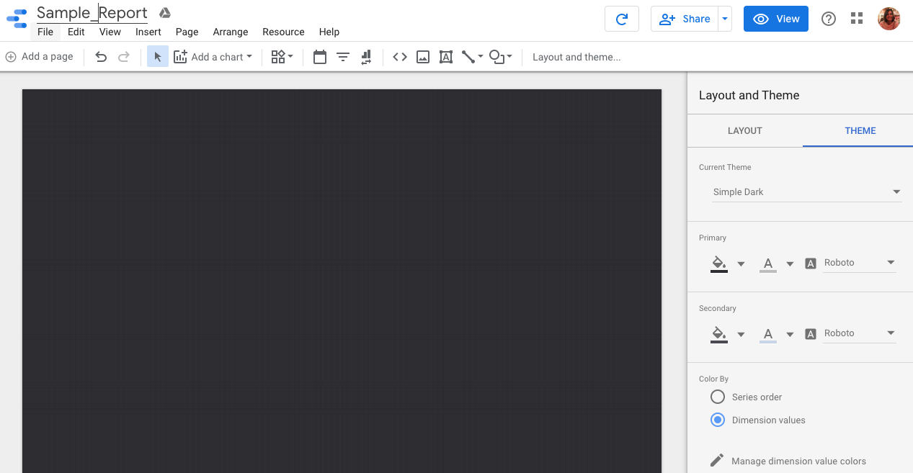
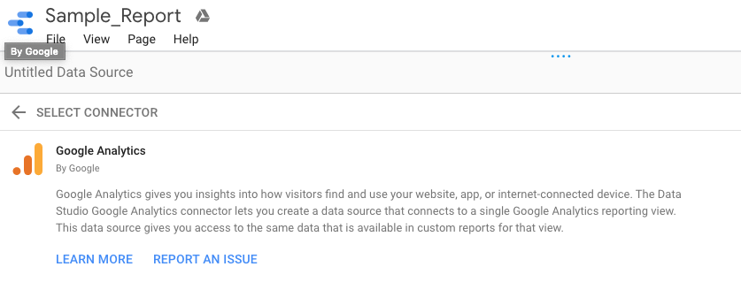

# Analysis of Google Data Studio and PowerBI.

Google Data Studio and PowerBI are two very similar tools for data analysis. PowerBI was lauched by Microsoft in 2014 and Data Studio was launched by Google in 2016. PowerBI is available as a mobile application, desktop application, and an online version as far as Data Studio goes it is only available online. In a 3 article series I aim to explore how similar and/or different are these two Data Analysis tools and show you how to integrate them. I am going to use my webpage <strong>i.e. nehaniphadkar.in</strong> that you are currently on as a product for analysis. This article will start off with Google Data Studio and creating some basic static visualization using data generated by Google Analytics platform for this webpage.

# Google Data Studio

Google data studio provides a wide variety of sources for importing data. The data needs to be preprocessed and cleaned before we connect it to the Data Studio. Out of the hundreds of sources and connectors available, mentioned below are the few popular connectors out there and I am going to use Google Analytics.

1. Google Analytics
2. Google Ads
3. Google Sheets
4. Big Query
5. Cloud SQL for MySQL
6. PostgreSQL

I already have an Google Analytics account and I have been monitoring the performance and reach of my website since its inception. I used the same account to sign in to Google Data Studio as I had used for Google Analytics. Once you are logged in you will see a page similar to this 

The layout of Data Studio is similar to the layout of Google Drive. Data Studio gives you the option to Create new reports or browse existing templates and use one. It lets you pick your Data sources and Explore the existing labs. I will be creating a blank report and connecting my Google Analytics account to import my site data. A blank report will look exactly like a Google doc and I like to make some basic changes before I start, I'll go ahead and change the name of the document on the upper right hand corner and change the layout to,"Simple dark" it is easier on the eyes. 

Next, we'll connect a data source, on the bottom right page you can see the option, "CREATE NEW DATA SOURCE". It will take you to the connectors page and out of the 18 connectors provided by Google we are going to choose Google Analytics.

After authorizing the application, it let you pick amongst the various projects available in your Google Analytics directory. I chose my webpage and immediately it pulls up all of the information it has on my website. I do not wish to cram all of the information on a single page report so I am going to focus on 5 aspects that are important to me right now.

1. The source of visit (mobile, desktop, and/or laptop)
2. The type of visit (organic, referral, and/or none/direct)
3. The region (Continent, Country, City)
4. Page Views
5. The kind of visitor (New or Returning visitor)

I will look at the source of the visit, are people using their mobile phones or desktops to view my webpage. I want to know how do people find my website, I do not market my website heavily so I want to know is someone telling them about my website like my Github, LinkedIn, or other social site. I also want to know which region is the audience from, If I am appying for a job in, "Region X" but all of my views or web traffic is from, "Region Y" it completely defeats the purpose. I also want to know why of my pages get the maximum number of views, how long are these visitors staying on a particular page or my site. The term bounce rate tells me if visitors like my webpage. Lastly, I want to know if I have new visitors or old visitors coming back to my page.

I will talk about two fields in the Data Studio platform that will help you create basic visualizations. Firstly we'll navigate to something called, "Filter Control". 

Path: Data Studio -> Your report -> Insert -> Filter Control

Filter Control lets you pick amongst the different dimensions and metrics in your data field. Which fields to pick and choose from depend on your data and the questions you want answered. The dimensions of Geo Network, User, Session, Traffic Sources, Platform or Device, and User Timing is important for my visualization. The complete list is mentioned below

- Default Group
- Adwords
- Ecommerce
- App Tracking
- Content Grouping
- Event Tracking
- User Timing
- Social Interactions
- Time
- GeoTracking

Let's create some basic visualizations

### Visualization 1

1. Go to Insert, click on, "Filter Control". Drop it at the top of the page
2. On the right hand side, under Data. Change the dimension to, "Country".
3. Click on Insert -> GeoMap. Drop it below the filter.

<!--  -->

<iframe width="500" height="250" src="https://datastudio.google.com/embed/reporting/14QFZGQDLMRHDLPFSOuYkCv8PZkYz_IE_/page/Bjz2" frameborder="0" style="border:0" allowfullscreen></iframe>

I immediately get a visualization of traffic sources based on the Continent.

### Visualization 2

1. Go to Insert, Area Chart
2. On the right hand side, under Data. Change the dimension to, "Date".

I get the, "Type of Visit" on a timeline. It gives me the area chart for Organic, Referral, and Direct visits to my webpage. It also tell me that visits to my webpage have gone up in the last 30 days. The maximum visits have been from a referral. If I analyze the data further, I know it is from GitHub Inc.

<!--  -->

<iframe width="500" height="250" src="https://datastudio.google.com/embed/reporting/1veD3rPxFAyaZG4gDU0qPizCQNGXIMnqw/page/Aiz2" frameborder="0" style="border:0" allowfullscreen></iframe>

### Visualization 3

1. Go to Insert, Pivot table
2. On the right hand side, under Data. Change the dimension to, "Page".

<!--  -->

<iframe width="500" height="250" src="https://datastudio.google.com/embed/reporting/1MwsfySX8rSXE75FqX3XoTwxqQYtmbQoH/page/qSV2" frameborder="0" style="border:0" allowfullscreen></iframe>

I can see how many visitors have gone beyond the first page i.e. the landing page onto other pages like blogs, projects, small programs, resume etc.

### Complete Single Page Report

<iframe width="600" height="800" src="https://datastudio.google.com/embed/reporting/1M5eHgUEVkSdFd7C3OqdXiL-NOPlLOWkI/page/jYO2" frameborder="0" style="border:0" allowfullscreen></iframe>

I've used these techniques to create a basic single page report for my [webpage](https://datastudio.google.com/s/lKdIY45K8C4). Google Analytics and Google Data Studio are free tools that are easily accessible. You can create powerful reports to help you analyze your products and support your business goals.

In the third part of this series, I'll create a similar report using PowerBI.
