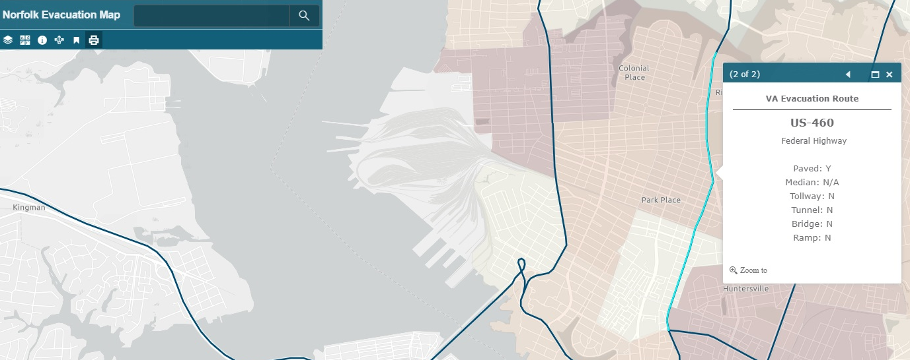
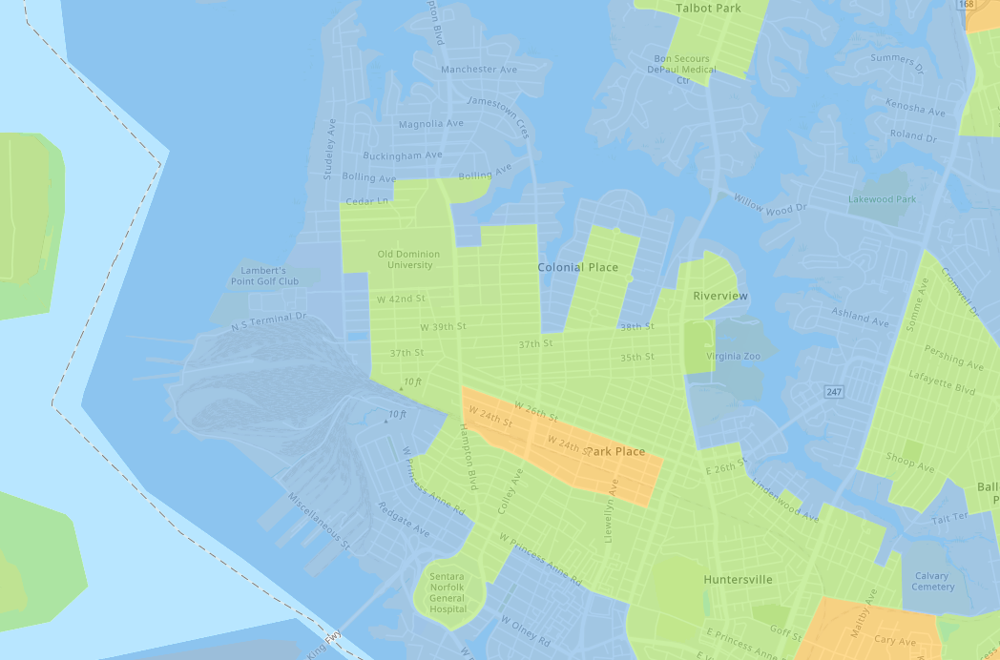

ArcGIS is a geographic information system for working with maps and geographic information developed by ESRI.
I used ArcGIS in one of the Artificial Intelligence projects. The tutorial on how to use the ArcGIS online is [here](https://learn.arcgis.com/en/projects/get-started-with-arcgis-online/)

I have created a Base map of the Hurricane Evacuation Route for The City of Norfolk, Virginia. The map is overlaid with economic data, the darker shades on the map highlight areas of the city who might need assistance while evacuation. The map can be found [here](http://www.arcgis.com/apps/View/index.html?appid=3c55e413a2c14ad3845976dd0a5b86f8).

Figure 1: Image of the map generated using ArcGIS online and ODU data.

Figure 2: Image of the map available of the Norfolk.gov website.

The map available on the Norfolk.gov website is informative and it tells you which zone are you located in and it shows which direction does the traffic flow. However it does not connect the main inner roads to the Evacuation routes. For e.g. Hampton Boulevard is a main road which connects to the local neighborhoods to the Interstate system. This particular piece of information might be useful.
