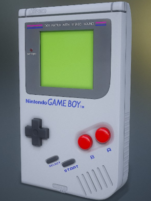
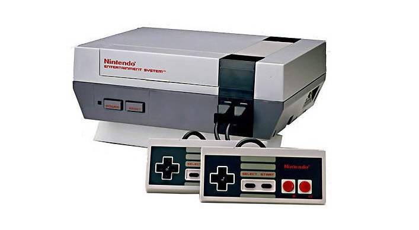
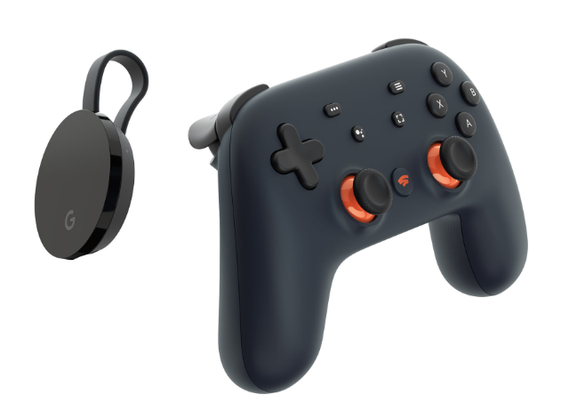

Video games have been a way of life since the 90’s, Brother of mine and I started off with the handheld Nintendo Gameboy in mid-90. It was the coolest gadgets our parents gifted us 🙏Thank you Mom and Dad  👪

The second addition and a big one too that was a Nintendo Entertainment System. Oh boy, we played everything from Mario, Super Mario, Contra, etc and we played for hours in the end. I can’t imagine how frustrated my parents would have been with us but it was the best of times brother of mine and I still reminisce about it

> I still have this console in perfect, pristine condition, with all of the nintendo cassettes 😁

From Nintendo, we jumped into the world of PlayStation and Microsoft Xbox, our world was transformed by the gaming experience, the graphics, the game plays, the online gaming competitiveness. We still own a PS3, PS4 Pro, Microsoft Xbox 360, and Xbox One. We played everything from Need for Speed (NFS), Grand Theft Auto (GTA) Vice City and San Andreas, God of War, Assassins Creed and so many more. When I started working, I played less and less and I don't blame work. I'm going to blame Mumbai traffic for taking up all of my time away. I had an answer to that as well, PlayStation Portable and I was still able to play fairly the same games but it did not compare and I drifted away

Fast Forward to 2019  ➡️ Google Stadia Founder's Edition 😃

It is a Graduation gift from myself to myself for all the homeworks, assignments, and projects I have done in the past 2 years. <strong>It was about time for some well deserved gaming break</strong>

#TL;DR

+ It is affordable.. Take it from a Graduate student 

+ I can play wherever and whenever I want

+ On the worst of days, my internet speeds are still at 10-12 Mbps. Stadia with 720p resolution works smoothly

<strong>My two cents about Stadia</strong>

> Yes, its important to read the reviews and listen to people's experiences but decide what works for you. Stadia is one of the good decisions I have made and I love every second of my game time.

